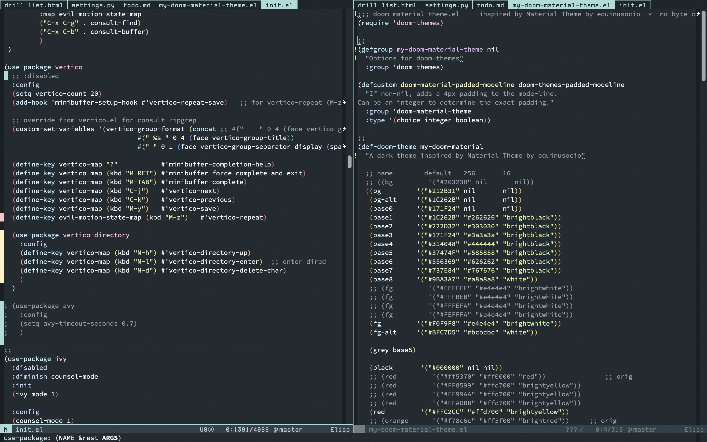

# .emacs.d



This branch is for:

- PC: NIPOGI GK3 PRO (N5105 2.9GHz, 8GB/256GB)
- OS: Pop!\_OS 22.04
- Emacs: 29.2.50 (from source)

## Install Emacs 29 (NATIVE_COMP) into Pop!\_OS 22.04
### build
```
sudo apt install gnutls-dev texinfo autoconf libjpeg-dev libgif-dev libtiff-dev libgtk-3-dev libgcc-jit-11-dev libncurses-dev

git clone --depth 1 --branch emacs-29 https://git.savannah.gnu.org/git/emacs.git
cd emacs

./autogen.sh
./configure -with-x-toolkit=gtk3 --with-native-compilation --without-mailutils
make -j4
```

### install
```
sudo make install
sudo update-alternatives --install /usr/bin/emacs emacs /usr/local/bin/emacs-29.2.50 99
```
### check
```
`which emacs` --version
→ GNU Emacs 29.2.50

emacs --batch --eval="(print system-configuration-features)"|grep NATIVE_COMP
→"CAIRO DBUS FREETYPE GIF GLIB GMP GNUTLS GSETTINGS HARFBUZZ JPEG LIBSELINUX LIBXML2 MODULES NATIVE_COMP NOTIFY INOTIFY PDUMPER PNG SECCOMP SOUND THREADS TIFF TOOLKIT_SCROLL_BARS X11 XDBE XIM XINPUT2 XPM GTK3 ZLIB"
```
### mozc
```
sudo apt install emacs-mozc emacs-mozc-bin
```
